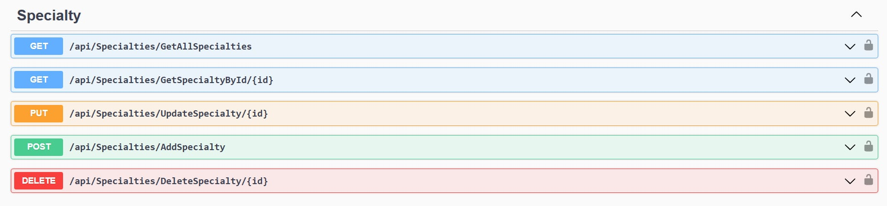
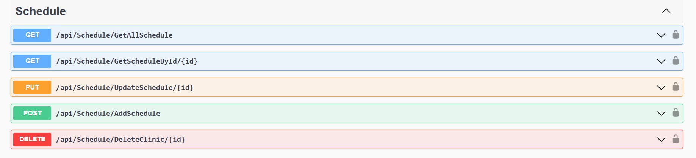
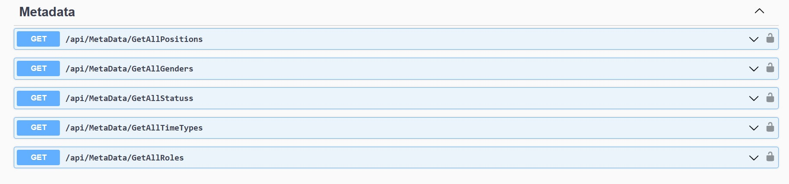
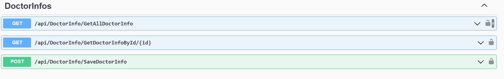
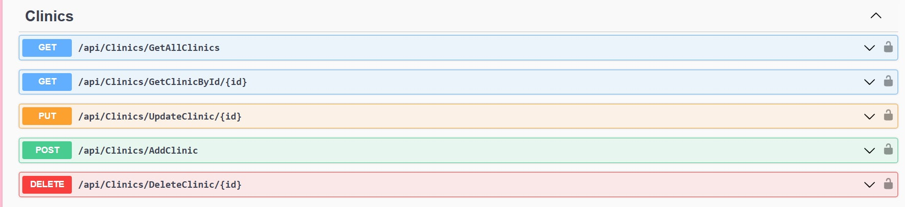
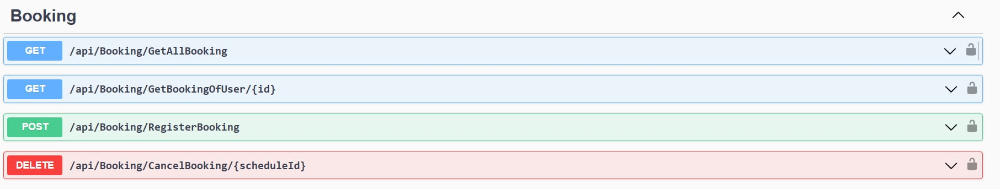
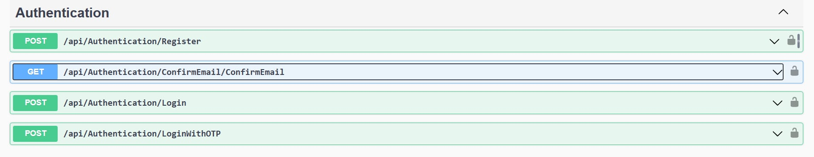
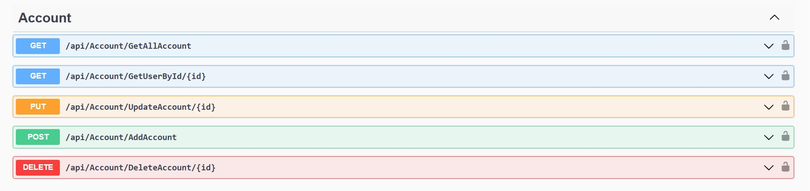

## Api dự án đặt lịch khám trực tuyến

Dự án cá nhân dựa trên web bookingcare sern stack của hoidanit viết bằng aspnet

### API CRUD chuyên khoa

### API CRUD lịch khám

### API Lấy các thông tin cơ bản

### API Lưu và lấy thông tin bác sĩ

### API CRUD phòng khám

### API đặt, hủy, xem lịch khám đã đăng ký của người dùng

### API đăng nhập, đăng ký, xác nhận email

### API CRUD tài khoản

